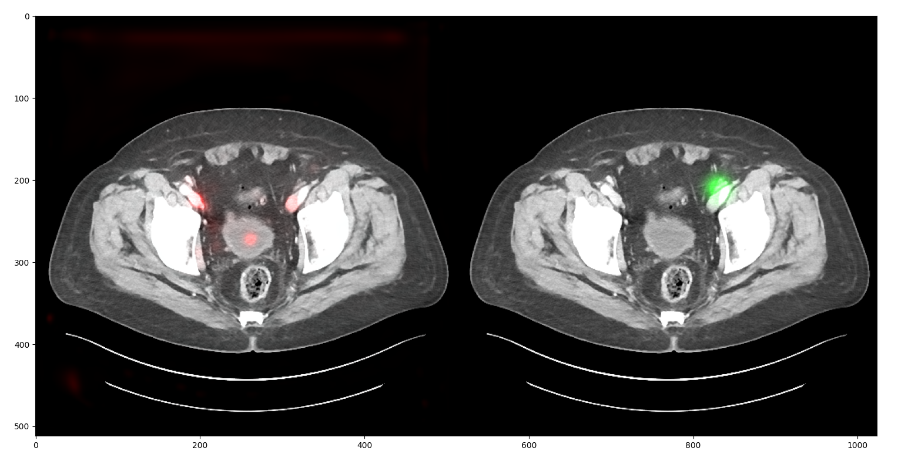

# sa-21-deep-lesion
UCU Software Architecture for Data Science in Python Course 2021

### FastAPI Server for Deep Lesion Detection/Segmentation

#### Team: Illia Ovcharenko, Marian Petruk, Anastasia Holovenko

The purpose of our project is to set up a server to perform lesion detection/segmentation on CT scans.
Lesion detection task is highly time-consuming and costly. Radilogists have to spend a lot of time
manually adding bookmarks. What is more, they usually add it only for one lesion's key slide per CT scan.
We, however, would like to optimize this process and provide anyone with an opportunity to upload their CT scan
and use our model to detect/segment a lesion on one's scan.

**Step 1**: Simply set up of a server </b>

Run server locally
```
 pyenv install 3.9.2 
 pyenv virtualenv 3.9.2 deep-lesion
 source <path-to-env>/deep-lesion/bin/activate
 pip install -r requirements.txt
 uvicorn setup:app --host 0.0.0.0 --port 80
```

Run in docker container
```
 docker build . -t deep-lesion:latest
 docker run -p 80:80 deep-lesion
```

**Step 2**: Upload your CT scan image as a `*.png`, `*.jpeg` or `*.jpg` file



**Step 3**: Get detection/segmentation results

##### Warning: Please, don't jump to any conclusions and consult with your therapist! 
